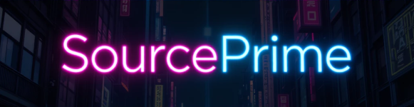
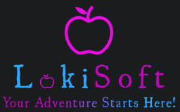

[](https://github.com/LokiRothbrook/SourcePrime)[](https://www.lokisoft.xyz)
# SourcePrime: A Neon-Charged Ghost Theme Forked From Source With Several Quality of Life Enhancements. Brought to you by LokiSoft

**SourcePrime** is a vibrant fork of [TryGhost/Source](https://github.com/TryGhost/Source), built for [lokisoft.xyz](https://lokisoft.xyz)’s free tech education quest. With neon aesthetics, sticky navigation bars, tocbot-powered Table of Contents, and Prism syntax highlighting, it’s designed for community-driven learning and amazing neon pop. 


## Features:

ZzZzZzZzZzZz... Yeah we know, This Feature Set is looking kind of empty right now! But Check out What We've got planned below!


## Coming Soon:

- **Publication Cover**: The publication cover has been revamped and resized to 300px width, 200px height and is reactive giving you the ability to have an amazing logo on your blog!

- **Neon Style**: Glowing borders and dividers with a neon vibe set to match your sites accent colors brings life to your content.

- **Sticky Navigation bar**: Stays put on desktop but gets out of the way on mobile.

- **Dynamic Table of Contents**: Tocbot auto-generates tables of contents (manual activation Via ghost snip-it required per post/page that needs a TOC). The Table of Contents has been restricted to only h2 elements and filters have been put into place so your callout cards and other cards you wouldn't want showing up or breaking your toc no longer show up. To add a cherry on top. We've added a button that follows your accent colors to open the toc on mobile. However. This feature comes at a price. Mobile has lost the ability to have a sticky button to open the portal on mobile. But we think you'll love what the toc brings to the table on mobile 

- **Code Highlighting**: Prism for codeblocks with Syntax highlighting. But we didn't stop there. This bad boy's Themed out to match your aesthetics, ands packing the copy button we've all come to love! 

- **Quizzes**: We've tapped into the power of Vue.js, With the power of snip-it code for HTML cards. Now with just a little tweaking, You can have interactive, fun quizzes baked right into your post! (manual activation Via ghost snip-it required per post/page that needs a quiz, footer injects might be required per page/post that needs a quiz! To be reviewed!)

- **Analytics**: With the power of PostHog/GA4 You can actually see how your quizzers are doing! Gather Data and Rise to the top!(via site wide or per page/post code injections. for tracking of engagement with quizzes and/or other things.)

- **Engagement**: Newsletter forms, Discourse links, X/Reddit embeds.

- **Monetization**: We're Leveling up the playing field when it comes to more ways to make money! Google AdSense, Buy Me a Coffee, Donation through PayPal, We've got that covered to.  (through site wide or per page/post code injections. to be reviewed!)


## Installation:

1. Clone: `git clone https://github.com/LokiRothbrook/SourcePrime.git`.
2. Copy to Ghost: `/var/www/ghost/content/themes/SourcePrime`.
3. Restart: `ghost restart`.
4. Activate in Ghost admin: Settings > Design > Change Theme.
5. Put some new paint on that bad boy!: 


## Customization Options:

Coming Soon!


## Snip-It PowerUp's:

Coming Soon!


# First time using a Ghost theme?

Ghost uses a simple templating language called [Handlebars](http://handlebarsjs.com/) for its themes.

This theme has lots of code comments to help explain what's going on just by reading the code. Once you feel comfortable with how everything works, we also have full [theme API documentation](https://ghost.org/docs/themes/) which explains every possible Handlebars helper and template.

**The main files are:**

- `default.hbs` - The parent template file, which includes your global header/footer
- `home.hbs` - The homepage
- `index.hbs` - The main template to generate a list of posts
- `post.hbs` - The template used to render individual posts
- `page.hbs` - Used for individual pages
- `tag.hbs` - Used for tag archives, eg. "all posts tagged with `news`"
- `author.hbs` - Used for author archives, eg. "all posts written by Jamie"

One neat trick is that you can also create custom one-off templates by adding the slug of a page to a template file. For example:

- `page-about.hbs` - Custom template for an `/about/` page
- `tag-news.hbs` - Custom template for `/tag/news/` archive
- `author-ali.hbs` - Custom template for `/author/ali/` archive


# Development

Source styles are compiled using Gulp/PostCSS to polyfill future CSS spec. You'll need [Node](https://nodejs.org/), [Yarn](https://yarnpkg.com/) and [Gulp](https://gulpjs.com) installed globally. After that, from the theme's root directory:

```bash
# install dependencies
yarn install

# run development server
yarn dev
```

Now you can edit `/assets/css/` files, which will be compiled to `/assets/built/` automatically.

The `zip` Gulp task packages the theme files into `dist/<theme-name>.zip`, which you can then upload to your site.

```bash
# create .zip file
yarn zip
```

# PostCSS Features Used

- Autoprefixer - Don't worry about writing browser prefixes of any kind, it's all done automatically with support for the latest 2 major versions of every browser.


# SVG Icons

Source uses inline SVG icons, included via Handlebars partials. You can find all icons inside `/partials/icons`. To use an icon just include the name of the relevant file, eg. To include the SVG icon in `/partials/icons/rss.hbs` - use `{{> "icons/rss"}}`.

You can add your own SVG icons in the same manner.


# Copyright & License

Copyright (c) 2025 LokiSoft - Released under the [MIT license](LICENSE).